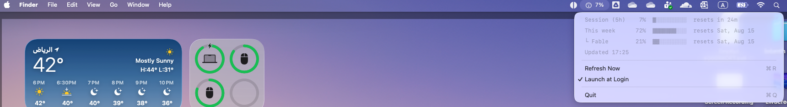

# ClaudeUsageBar

A macOS, Windows, and Linux menu bar / tray readout of your **Claude Code**
and **ChatGPT Codex CLI** usage — each provider's primary window at a glance,
with the weekly window, per-model scopes, and per-provider sections in the
dropdown.

The screenshot above is the macOS build, from before Codex support existed —
the current menu bar shows a small drawn mark and a percentage per signed-in
provider, side by side. The Windows and Linux trays present the same
information through their platform's own notification-area conventions — see
below.

Those marks are hand-drawn monochrome approximations — a six-spoke asterisk
for Claude, a hexagon ring with an inner dot for Codex — not Anthropic's or
OpenAI's official logos. That's deliberate, not a shortcut: bundling the real
brand assets would mean licensing and keeping them in sync, and a drawn glyph
can be marked as a template image so it adapts automatically to light mode,
dark mode, and tinted menu bars, which a bitmap logo can't do for free. See
`ProviderMark.swift` for the drawing code.

Both providers are read-only and independent: **Claude Code**'s OAuth token is
read from your login Keychain (macOS) or `~/.claude/.credentials.json` /
`$CLAUDE_CONFIG_DIR` (Linux/Windows), and its usage is polled from
`https://api.anthropic.com/api/oauth/usage`. **ChatGPT Codex**'s token is
read from `~/.codex/auth.json` (or `$CODEX_HOME`) on every platform, and its
usage is polled from an undocumented ChatGPT backend endpoint that can change
without notice — the decoder fails cleanly rather than crashing if it does.
Neither token is ever written, refreshed, logged, or otherwise touched beyond
being read and sent as a bearer credential: each CLI owns and rotates its own
token. A provider you are not signed into is simply omitted from the display,
not shown as an error.

When a token expires, the app says so for that provider and defers to the
owning CLI (`claude` or `codex`) to refresh it.

## Build

    ./Scripts/build-app.sh
    open dist/ClaudeUsageBar.app

Move `dist/ClaudeUsageBar.app` to `/Applications` before enabling "Launch at
Login" — `SMAppService` is unreliable for bundles elsewhere.

macOS will ask for Keychain access the first time, because the item was
created by the Claude Code CLI. Choose "Always Allow".

### Linux

    sudo apt install libayatana-appindicator3-dev libgtk-3-dev
    ./Scripts/build-linux.sh

Works on KDE, XFCE, Cinnamon, MATE and Budgie. **GNOME** hides tray icons
unless the [AppIndicator extension](https://extensions.gnome.org/extension/615/appindicator-support/)
is installed — that applies to every tray app, not just this one.

The Claude Code token is read from `~/.claude/.credentials.json` (or
`$CLAUDE_CONFIG_DIR`); the Codex token from `~/.codex/auth.json` (or
`$CODEX_HOME`). Both read-only — nothing here ever writes either.

The menu bar label names each signed-in provider next to its reading, e.g.
`Claude 37% · Codex 8%` — or just `Codex 8%` if only Codex is signed in.
Naming the provider matters here more than on macOS: with only one provider
signed in, a bare `8%` would be indistinguishable from the other provider's
reading.

### Windows

    swift build -c release

The tray icon has room for only one number, so it draws whichever signed-in
provider comes first (Claude, then Codex) — because the Windows notification
area has no text field beside an icon. The tooltip has no such size limit and
names every signed-in provider, e.g. `Claude 37% · Codex 8%`, so it carries
more than the icon alone, not merely the same reading. Left-click or
right-click the icon for the menu.

The Claude Code token is read from `%USERPROFILE%\.claude\.credentials.json`
(or `%CLAUDE_CONFIG_DIR%`); the Codex token from `%USERPROFILE%\.codex\auth.json`
(or `%CODEX_HOME%`). Both read-only.

## Verification boundary

The macOS build is hand-verified end to end. The Linux and Windows tray
backends are proven only to compile, link, and pass the shared logic tests in
CI — hosted CI runners have no desktop shell, so `AppIndicatorTray` and
`Win32Tray` have never actually been run, by anyone, on a real Linux or
Windows machine. Expect a round of fixes once real users exercise them.

The ChatGPT Codex endpoint this app polls is undocumented, can change without
notice, and has been observed live exactly once, on a `free` plan. The
paid-plan response shape — a 5-hour primary window with a weekly secondary —
is inferred from the Codex CLI's own source, not from an observed response,
and is covered by a fabricated fixture rather than a real one.

This is a deliberate consequence of the architecture, not an oversight: all
the logic that decides *what number to show* — parsing the usage response,
computing percentages, deciding what's stale or critical, reading the token —
lives in `ClaudeUsageCore`, which every platform shares and which is fully
tested. The platform-specific tray backends only *display* what the core
already computed. A backend bug can draw the wrong pixels, misplace a menu
item, or crash the tray; it cannot show a wrong number or touch your
credential.

## Test

    swift test

154 tests on macOS as of this writing; a few more run on Linux and Windows —
the extra cases cover the file-based Claude Code token store
(`#if !os(macOS)`), which macOS doesn't use because it reads the Keychain
instead (Codex's file-based store runs its tests on every platform, since
Codex has no Keychain path at all). Everything is covered except the platform UI
layers themselves: `AppKitTray`, `AppIndicatorTray`, `Win32Tray`, the
platform login-item implementations, and the `SecItemCopyMatching` call are
verified by hand on macOS and, per the verification boundary above, not yet
run at all on Linux or Windows.

## Requirements

- **macOS** 14+, Swift 6, Claude Code signed in.
- **Linux**: `libayatana-appindicator3` and GTK3 (see the Linux section
  above), and a desktop that shows tray icons — GNOME needs the
  [AppIndicator extension](https://extensions.gnome.org/extension/615/appindicator-support/).
- **Windows** 10+.
