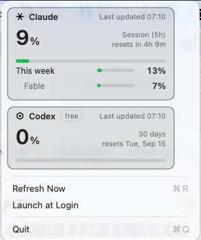

<div align="center">

# Headroom

**How much is left before a limit cuts off work mid-task?**

A menu bar readout of your **Claude Code** and **ChatGPT Codex** subscription
usage. Silent, read-only, and it never touches your credentials.

[](https://github.com/sunnixx/headroom/actions/workflows/ci.yml)


<br>



</div>

<br>

## What it does

One card per provider. The large number is the window that gates you
**soonest** — Claude's five-hour session, Codex's primary window — and the
rest sit beneath it.

|  | |
|---|---|
| **At a glance** | Each signed-in provider's mark and percentage, side by side in the menu bar |
| **Colour that means something** | Green under 75%, amber from 75%, red from 90% |
| **Honest when it fails** | Says *Rate limited*, *Offline* or *Server error* — never the wrong reason |
| **Never blanks a good value** | A transient failure keeps the last reading and dims it |
| **Survives token rotation** | One auth failure is a rotation window, not a sign-out |
| **Silent** | No notifications, no history, no cost accounting. A readout, nothing more |

A provider you are not signed into is simply **omitted** — not shown as an
error.

## Your credentials are read, never written

This is the part worth being precise about.

| Provider | Where the token lives |
|---|---|
| **Claude Code** | login Keychain (macOS), or `~/.claude/.credentials.json` / `$CLAUDE_CONFIG_DIR` |
| **ChatGPT Codex** | `~/.codex/auth.json` / `$CODEX_HOME` — a file on every platform |

Each CLI **owns and rotates its own token**, so Headroom contains no code path
that writes, creates, truncates or deletes either credential file. The token
is sent as a bearer credential to that provider's own endpoint and appears
nowhere else — not in a log, not in an error value, not on disk. Codex's
`refresh_token` and `id_token` are never even read.

The Codex response also carries your email, user ID and account ID. **None of
it is decoded** — those fields are simply absent from the type the response is
parsed into, which is a stronger guarantee than filtering them out afterwards,
and a test asserts none of it survives.

When a token expires, Headroom says so for that provider and defers to the
owning CLI to refresh it.

## Install

```bash
git clone https://github.com/sunnixx/headroom.git
cd headroom
./Scripts/build-app.sh
open dist/Headroom.app
```

Move `Headroom.app` to `/Applications` before enabling **Launch at Login** —
`SMAppService` is unreliable for bundles elsewhere. macOS will ask for Keychain
access on first run, because the item belongs to the Claude Code CLI; choose
**Always Allow**.

<details>
<summary><b>Linux</b></summary>

```bash
sudo apt install libayatana-appindicator3-dev libgtk-3-dev
./Scripts/build-linux.sh
```

Works on KDE, XFCE, Cinnamon, MATE and Budgie. **GNOME** hides tray icons
unless the [AppIndicator extension](https://extensions.gnome.org/extension/615/appindicator-support/)
is installed — that applies to every tray app, not just this one.

The label names each signed-in provider next to its reading — `Claude 37% ·
Codex 8%`, or just `Codex 8%` if only Codex is signed in. Naming matters more
here than on macOS: with one provider signed in, a bare `8%` would be
indistinguishable from the other provider's reading.

</details>

<details>
<summary><b>Windows</b></summary>

```bash
swift build -c release
```

The notification area has no text field beside an icon, so the percentage is
drawn *into* the icon and only one provider fits — whichever comes first among
those signed in. The tooltip has no such limit and names every signed-in
provider, so it carries more than the icon alone. Left- or right-click for the
menu.

</details>

## About the provider marks

The two glyphs are **hand-drawn monochrome approximations** — a six-spoke
asterisk for Claude, a hexagon ring with an inner dot for Codex — not
Anthropic's or OpenAI's official logos.

That is deliberate. Bundling real brand assets would mean licensing them and
keeping them in sync, and a drawn glyph can be marked as a template image so it
adapts automatically to light mode, dark mode and tinted menu bars, which a
bitmap can't do for free. The drawing code is in `ProviderMark.swift`.

## Architecture

```
HeadroomCore     usage decoding, refresh policy, formatting, menu model
HeadroomTokens   Keychain (macOS) + credential-file stores
HeadroomTray     TrayBackend protocol · AppKit · AppIndicator · Win32
Headroom         the executable: poll loop, login item, platform wiring
```

One `UsageRefreshPolicy` **per provider**, each with its own backoff and
staleness, so one provider being rate-limited or signed out can never blank or
alter the other's reading.

## Test

```bash
swift test
```

164 on macOS; a few more on Linux and Windows, where the file-based Claude Code
token store also runs (macOS reads the Keychain instead). Everything is covered
except the platform UI layers, which are verified by hand on macOS.

## Requirements

- **macOS** 14+, Swift 6, Claude Code and/or Codex signed in
- **Linux** — `libayatana-appindicator3`, GTK3, and a desktop that shows tray icons
- **Windows** 10+
